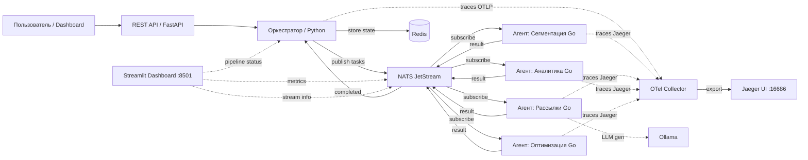

# Лабораторная работа №13 — Мультиагентные системы: разработка распределённых интеллектуальных агентов

**Студент:** Фризен Марк Владимирович
**Группа:** 221331
**Вариант:** 15 (Повышенная сложность)

---

## Содержание

1. [Предметная область](#предметная-область-автоматизация-маркетинга)
2. [Архитектура системы](#архитектура-системы)
3. [Состав сервисов](#состав-сервисов)
4. [Системные требования](#системные-требования)
5. [Установка и запуск](#установка-и-запуск)
6. [Доступ к веб-интерфейсам](#доступ-к-веб-интерфейсам)
7. [Работа с системой](#работа-с-системой)
8. [API оркестратора](#api-оркестратора)
9. [Дашборд](#дашборд-streamlit)
10. [Масштабирование агентов](#масштабирование-агентов)
11. [Автоматический scaler](#автоматический-scaler)
12. [Мониторинг и трассировка](#мониторинг-и-трассировка)
13. [Переменные окружения](#переменные-окружения)
14. [Управление конфигурацией](#управление-конфигурацией)
15. [Устранение неполадок](#устранение-неполадок)

---

## Предметная область: Автоматизация маркетинга

Система представляет собой распределённую мультиагентную платформу для управления маркетинговыми кампаниями. Агенты взаимодействуют через брокер сообщений **NATS**, оркестратор на **Python** управляет цепочками задач, а каждый агент реализован как отдельный микросервис на **Go**.

### Типы агентов

| Агент | Роль | Входные данные | Выходные данные | Бизнес-правила |
|-------|------|----------------|------------------|----------------|
| **Сегментация аудитории** | Анализирует клиентскую базу и выделяет целевые группы | Список клиентов (возраст, гео, покупки) | Сегменты аудитории (JSON) | Минимальный размер сегмента — 100 пользователей |
| **Создание рассылок** | Генерирует контент и отправляет сообщения через каналы | Сегмент, шаблон сообщения | Отчёт об отправке (успех/неудача) | Не более 1000 писем в час на канал |
| **Анализ отклика** | Собирает метрики: открытия, клики, конверсии | Данные из CRM / веб-аналитики | Статистика по кампании (CTR, ROI) | Обновление метрик каждые 5 минут |
| **Оптимизация кампаний** | Корректирует бюджет, ставки и креативы на основе аналитики | Текущие метрики, бюджет | Новые настройки кампании | Бюджет не может быть изменён более чем на 20% за раз |

> **LLM-генератор** (опционально): подключается при `USE_LLM=true` и генерирует текст рассылок через локальную модель Ollama.

---

## Архитектура системы



### Поток выполнения pipeline

```
POST /pipeline  ──►  Оркестратор
                        │
                        ├── 1. Публикация задачи "agent.segment" в NATS
                        │      └── Агент сегментации → возвращает сегменты
                        │
                        ├── 2. Публикация задачи "agent.campaign" (на каждый сегмент)
                        │      └── Агент рассылок → возвращает отчёт
                        │           └── (если USE_LLM=true) → LLM-генератор
                        │
                        ├── 3. Публикация задачи "agent.analytics"
                        │      └── Агент аналитики → возвращает метрики (CTR, ROI)
                        │
                        └── 4. (если ROI < 10%) Публикация задачи "agent.optimize"
                               └── Агент оптимизации → корректирует бюджет
                                   └── Повторная публикация "agent.analytics"
```

Все состояния pipeline сохраняются в Redis под ключами `pipeline:<uuid>`.

---

## Состав сервисов

| Сервис | Контейнер | Порт | Язык | Описание |
|--------|-----------|------|------|----------|
| **NATS** | `nats-broker` | 4222 (клиент), 8222 (HTTP API) | — | Брокер сообщений + JetStream |
| **Redis** | `redis-store` | 6379 | — | Хранилище состояний pipeline |
| **Оркестратор** | `orchestrator` | 8000 | Python (FastAPI) | REST API, управление pipeline |
| **Агент сегментации** | `agent-segmentation` | — | Go | Сегментация клиентов |
| **Агент рассылок** | `agent-campaign` | — | Go | Создание и отправка рассылок |
| **Агент аналитики** | `agent-analytics` | — | Go | Сбор метрик отклика |
| **Агент оптимизации** | `agent-optimizer` | — | Go | Оптимизация бюджета кампаний |
| **LLM-генератор** | `llm-generator` | — | Go | Генерация текста через Ollama |
| **Scaler** | `scaler` | — | Python | Автомасштабирование агентов |
| **Ollama** | `ollama` | 11434 | — | Локальная LLM |
| **OTel Collector** | `otel-collector` | 14268, 4317 | — | Агрегация трассировок |
| **Jaeger** | `jaeger` | 16686 (UI) | — | Хранилище и UI трассировок |
| **Streamlit Dashboard** | `dashboard` | 8501 | Python (Streamlit) | Веб-дашборд |

---

## Системные требования

- **Docker** версии 24.0+ и **Docker Compose** (v2, встроенный в Docker Desktop)
- **CPU**: минимум 2 ядра (рекомендуется 4+ для запуска всех агентов)
- **RAM**: минимум 4 ГБ (рекомендуется 8 ГБ для полноценной работы с Ollama)
- **Диск**: минимум 10 ГБ свободного места
- **ОС**: Linux, macOS или Windows (с WSL2)

Проверка установки:

```bash
docker --version
docker compose version
```

---

## Установка и запуск

### 1. Клонирование репозитория

```bash
git clone <repository-url> LR13
cd LR13
```

### 2. Запуск всех сервисов

```bash
docker compose up -d
```

Эта команда запускает все сервисы в фоновом режиме. Первый запуск может занять несколько минут (скачивание образов, сборка Go-агентов).

### 3. Проверка состояния

```bash
# Статус всех контейнеров
docker compose ps

# Логи всех сервисов (в реальном времени)
docker compose logs -f

# Логи конкретного сервиса
docker compose logs orchestrator -f
docker compose logs dashboard -f
```

### 4. Остановка

```bash
# Остановка всех сервисов
docker compose down

# Остановка с удалением томов (сброс всех данных)
docker compose down -v
```

---

## Доступ к веб-интерфейсам

После запуска (`docker compose up -d`) следующие интерфейсы становятся доступны на хосте:

| Интерфейс | URL | Описание |
|-----------|-----|----------|
| **Streamlit Dashboard** | [http://localhost:8501](http://localhost:8501) | Главный дашборд системы |
| **Orchestrator API** | [http://localhost:8000](http://localhost:8000) | REST API (Swagger: `/docs`, ReDoc: `/redoc`) |
| **Jaeger UI** | [http://localhost:16686](http://localhost:16686) | Трассировка запросов |
| **NATS Monitor** | [http://localhost:8222](http://localhost:8222) | Мониторинг NATS |
| **Ollama API** | [http://localhost:11434](http://localhost:11434) | API локальной LLM |

---

## Работа с системой

### Запуск тестового pipeline

Самый простой способ проверить работу системы — запустить тестовый pipeline через дашборд или напрямую через API.

#### Через Streamlit Dashboard

1. Откройте [http://localhost:8501](http://localhost:8501)
2. Перейдите на вкладку **"🧪 Тест"**
3. Нажмите кнопку **"🚀 Запустить тестовую задачу"**
4. Дождитесь завершения (обычно 10–30 секунд)
5. Переключитесь на вкладку **"📊 Дашборд"** для просмотра метрик

#### Через API (curl)

```bash
# Запуск тестового pipeline (50–200 случайных клиентов)
curl -X POST http://localhost:8000/test

# Запуск своего pipeline
curl -X POST http://localhost:8000/pipeline \
  -H 'Content-Type: application/json' \
  -d '{
    "campaign_channel": "email",
    "clients": [
      {"id": 1, "name": "Иван", "age": 25, "region": "MSK", "purchases": 10},
      {"id": 2, "name": "Мария", "age": 45, "region": "SPB", "purchases": 30}
    ]
  }'
```

### Проверка статуса pipeline

```bash
# Замените <id> на ID из ответа предыдущего запроса
curl http://localhost:8000/pipeline/<id>
```

Пример ответа:

```json
{
  "pipeline_id": "a1b2c3d4-e5f6-7890-abcd-ef1234567890",
  "status": "completed",
  "stages": [
    {"name": "segmentation", "status": "completed", "result": {"segments": 3}},
    {"name": "campaign", "status": "completed", "result": {"sent": 150}},
    {"name": "analytics", "status": "completed", "result": {"ctr": 12.5, "roi": 45.3}}
  ]
}
```

### Проверка здоровья системы

```bash
curl http://localhost:8000/health
```

Пример ответа:

```json
{
  "status": "ok",
  "nats": "connected",
  "redis": "connected"
}
```

---

## API оркестратора

Оркестратор доступен по адресу `http://localhost:8000`. Swagger-документация: [http://localhost:8000/docs](http://localhost:8000/docs), ReDoc: [http://localhost:8000/redoc](http://localhost:8000/redoc).

### Эндпоинты

| Метод | Путь | Описание |
|-------|------|----------|
| `GET` | `/health` | Проверка состояния сервиса и зависимостей |
| `POST` | `/test` | Запуск тестового pipeline со случайными клиентами |
| `POST` | `/pipeline` | Запуск pipeline с переданными клиентами |
| `GET` | `/pipeline/{id}` | Получение статуса/результата pipeline |

### Модель Client

```json
{
  "id": 1,
  "name": "Иван",
  "age": 25,
  "region": "MSK",
  "purchases": 10
}
```

**Параметры:**
- `id` (int, required) — уникальный идентификатор клиента
- `name` (str, required) — имя клиента
- `age` (int, 16–65, required) — возраст
- `region` (str, required) — регион (допустимые: MSK, SPB, EKB, NSK, KZN, RND, SAM, UFA)
- `purchases` (int, 0+, required) — количество покупок

### Модель PipelineRequest

```json
{
  "campaign_channel": "email",
  "clients": [ ... ]
}
```

**Параметры:**
- `campaign_channel` (str, default: `"email"`) — канал рассылки
- `clients` (array[Client], 1–1000 элементов) — список клиентов

---

## Дашборд (Streamlit)

Веб-дашборд доступен по адресу [http://localhost:8501](http://localhost:8501).

### Тёмная тема

Дашборд использует тёмную тему Streamlit (`base = "dark"`), заданную в файле `.streamlit/config.toml`. При необходимости цвета можно изменить:

```toml
# .streamlit/config.toml
[theme]
base = "dark"
primaryColor = "#ff4b4b"      # акцентный цвет
backgroundColor = "#0e1117"    # основной фон
secondaryBackgroundColor = "#262730"  # вторичный фон
textColor = "#fafafa"          # цвет текста
```

### Автообновление

Дашборд автоматически обновляется каждые **5 секунд** (настраивается через переменную `REFRESH_SEC` в `dashboard.py`). Механизм:
- `st.empty()` — создаёт контейнер для перерисовки контента
- `time.sleep(REFRESH_SEC)` — задержка между обновлениями
- `st.rerun()` — полный перезапуск скрипта

Данные для метрик кэшируются на `REFRESH_SEC` секунд через `st.cache_data(ttl=REFRESH_SEC)`, поэтому реальная частота запросов к внешним сервисам не превышает 1 раза в 5 секунд даже при частых rerun.

### Вкладки дашборда

**📊 Дашборд** — основная панель:
- Количество активных NATS-агентов (с группировкой по типу)
- Количество NATS-соединений
- Длина очереди JetStream (количество сообщений)
- Объём данных в стриме
- Список активных агентов и их подписок
- Последние завершённые pipeline с метриками (ROI, CTR)

**🧪 Тест** — запуск тестового pipeline:
- Кнопка "🚀 Запустить тестовую задачу"
- Список последних запусков

**🔍 Jaeger** — встроенный фрейм Jaeger UI:
- Ссылка на Jaeger UI
- Iframe с интерфейсом поиска трассировок

---

## Масштабирование агентов

Вручную можно задать количество реплик каждого Go-агента при запуске:

```bash
# Запуск с несколькими репликами агента сегментации
docker compose up -d --scale segmentation=3

# Комбинированное масштабирование
docker compose up -d \
  --scale segmentation=3 \
  --scale campaign=2 \
  --scale analytics=2 \
  --scale optimizer=1
```

> **Важно:** `--scale` работает только при первом запуске или после `docker compose down` (не с `--no-recreate`). Для безопасного масштабирования без остановки используйте:
> ```bash
> docker compose up -d --scale segmentation=3 --no-deps --no-recreate segmentation
> ```

---

## Автоматический scaler

Сервис `scaler` (контейнер `scaler`) автоматически управляет количеством реплик агента сегментации (`segmentation`) на основе двух метрик:

### Метрики

| Метрика | Источник | Интервал | Порог scale-up | Порог scale-down |
|---------|----------|----------|----------------|-----------------|
| Длина очереди NATS | JetStream `TASKS` | 15 сек | > 100 сообщений | < 10 сообщений |
| CPU агентов | Prometheus | 15 сек | > 0.7 (среднее за 1 мин) | < 0.3 (среднее за 1 мин) |

### Правила

- **Scale-up** (+1 реплика): очередь > 100 **или** средний CPU > 0.7
- **Scale-down** (−1 реплика): очередь < 10 **и** средний CPU < 0.3
- **Ограничения**: MIN_REPLICAS = 1, MAX_REPLICAS = 5
- **Блокировка**: Redis-лок `scaler:lock:segmentation` (TTL 30 с) предотвращает одновременное масштабирование

### Бекенды

Scaler поддерживает два бекенда (автоопределение):

1. **Docker** (по умолчанию): вызывает `docker compose up -d --scale segmentation=N`
2. **Kubernetes**: использует `kubectl scale deployment/agent-segmentation --replicas=N`

Для принудительного выбора бекенда:

```bash
# В docker-compose.yml → сервис scaler → environment:
SCALER_BACKEND=docker   # или k8s
```

---

## Мониторинг и трассировка

### Jaeger Tracing

Система собирает распределённые трассировки через OpenTelemetry:

1. **Python-оркестратор** → OTLP gRPC (порт 4317) → **OTel Collector** → Jaeger
2. **Go-агенты** → Jaeger Thrift HTTP (порт 14268) → **OTel Collector** → Jaeger

Откройте [http://localhost:16686](http://localhost:16686), выберите сервис `orchestrator` и нажмите **Find Traces**.

### NATS Monitoring

NATS HTTP API доступен по адресу [http://localhost:8222](http://localhost:8222):

```bash
# Список соединений
curl http://localhost:8222/connz

# Информация о JetStream
curl http://localhost:8222/jsz

# Информация о стриме TASKS
curl http://localhost:8222/jsz?stream=TASKS
```

### Redis

```bash
# Подключение к Redis из контейнера
docker exec -it redis-store redis-cli

# Список всех pipeline
KEYS pipeline:*

# Просмотр конкретного pipeline
GET pipeline:<id>
```

---

## Переменные окружения

### NATS

| Переменная | По умолчанию | Описание |
|-----------|-------------|----------|
| `NATS_URL` | `nats://nats:4222` | Адрес NATS (внутри сети Docker) |
| `NATS_HTTP` | `http://nats:8222` | HTTP-мониторинг NATS |
| `SCALER_STREAM` | `TASKS` | Имя JetStream-стрима |

### Redis

| Переменная | По умолчанию | Описание |
|-----------|-------------|----------|
| `REDIS_URL` | `redis://redis:6379/0` | Адрес Redis |
| `REDIS_ADDR` | `redis:6379` | Адрес Redis (Go-агенты) |

### Оркестратор

| Переменная | По умолчанию | Описание |
|-----------|-------------|----------|
| `OTEL_EXPORTER_OTLP_ENDPOINT` | `http://otel-collector:4317` | Endpoint для OTLP трассировки |
| `USE_LLM` | `true` | Включить генерацию текста через LLM |
| `CAMPAIGN_MESSAGE_TEMPLATE` | `Здравствуйте! Специальное предложение для вас.` | Шаблон сообщения |

### Дашборд

| Переменная | По умолчанию | Описание |
|-----------|-------------|----------|
| `NATS_HTTP` | `http://nats:8222` | HTTP-мониторинг NATS |
| `ORCHESTRATOR_URL` | `http://orchestrator:8000` | Адрес оркестратора |
| `JAEGER_UI_URL` | `http://localhost:16686` | Адрес Jaeger UI |

### Scaler

| Переменная | По умолчанию | Описание |
|-----------|-------------|----------|
| `SCALER_BACKEND` | `auto` | Бекенд масштабирования: `docker`, `k8s` |
| `PROMETHEUS_URL` | `http://prometheus:9090` | Prometheus API |
| `SCALER_SERVICE` | `segmentation` | Имя сервиса для масштабирования |
| `SCALER_STREAM` | `TASKS` | JetStream-стрим для мониторинга очереди |

### LLM-генератор

| Переменная | По умолчанию | Описание |
|-----------|-------------|----------|
| `OLLAMA_URL` | `http://ollama:11434` | Адрес Ollama |
| `OLLAMA_MODEL` | `llama3` | Модель для генерации |

---

## Управление конфигурацией

### Pull-модель запуска дашборда

```bash
# Запуск дашборда отдельно от Docker (для разработки)
cd LR13

# Установка зависимостей
pip install -r cmd/dashboard/requirements.txt

# Запуск с подключением к запущенным контейнерам
NATS_URL="nats://localhost:4222" \
NATS_HTTP="http://localhost:8222" \
REDIS_URL="redis://localhost:6379/0" \
ORCHESTRATOR_URL="http://localhost:8000" \
JAEGER_UI_URL="http://localhost:16686" \
  streamlit run dashboard.py --server.port 8501
```

### Pull-модель запуска оркестратора

```bash
cd LR13/orchestrator
python -m venv .venv
source .venv/bin/activate
pip install -r requirements.txt

NATS_URL="nats://localhost:4222" \
REDIS_URL="redis://localhost:6379/0" \
  uvicorn main:app --host 0.0.0.0 --port 8000 --reload
```

### Сборка одного агента

```bash
# Сборка образа конкретного агента без docker-compose
docker build \
  --build-arg AGENT=segment \
  -t marketing-agent:segment \
  -f Dockerfile .
```

---

## Устранение неполадок

### Проблема: контейнеры не стартуют

```bash
# Проверка логов всех контейнеров
docker compose logs

# Проверка логов конкретного контейнера
docker compose logs orchestrator

# Проверка свободных портов
lsof -i :8000
lsof -i :8501
lsof -i :4222
```

### Проблема: NATS connection refused

Убедитесь, что NATS здоров:

```bash
docker compose ps nats
curl http://localhost:8222/healthz
```

### Проблема: Redis connection refused

```bash
docker compose ps redis
docker exec redis-store redis-cli ping  # должен ответить PONG
```

### Проблема: дашборд не обновляется

Дашборд использует `st.rerun()` для автообновления. Если страница не обновляется:

1. Проверьте, что дашборд запущен: `docker compose ps dashboard`
2. Проверьте логи: `docker compose logs dashboard -f`
3. Вручную обновите страницу в браузере (F5)

### Проблема: не запускается питон в Windows

```bash
# Если streamlit не видит dashboard.py из корня
cd LR13
streamlit run dashboard.py --server.port 8501
```

### Проблема: Docker не имеет доступа к docker.sock внутри scaler

Scaler требует монтирования `/var/run/docker.sock` для работы с Docker API. Если масштабирование не работает:

```bash
# Проверьте монтирование
docker inspect scaler | grep docker.sock

# Убедитесь, что у текущего пользователя есть права на docker.sock
ls -la /var/run/docker.sock
```

### Проблема: Ollama не отвечает или медленно генерирует

```bash
# Проверьте, что Ollama запущен
docker compose ps ollama

# Проверьте логи Ollama
docker compose logs ollama

# Если модель не загружена, загрузите вручную:
docker exec ollama ollama pull llama3

# Отключите LLM-генерацию (используется шаблон):
# в docker-compose.yml → orchestrator → environment:
USE_LLM=false
```

### Полезные команды

```bash
# Полный сброс и перезапуск
docker compose down -v && docker compose up -d

# Перезапуск конкретного сервиса
docker compose restart dashboard

# Пересборка конкретного сервиса (после изменений кода)
docker compose build dashboard
docker compose up -d dashboard

# Подключение к контейнеру
docker exec -it orchestrator sh

# Мониторинг использования ресурсов
docker stats
```

---

## Структура проекта

```
LR13/
├── dashboard.py              # Streamlit-дашборд
├── scaler.py                 # Автомасштабирование агентов
├── Dockerfile                # Многостадийная сборка Go-агентов
├── docker-compose.yml        # Оркестрация всех сервисов
├── otel-collector-config.yml # Конфигурация OpenTelemetry Collector
├── README.md                 # Документация (текущий файл)
├── PROMPT_LOG.md             # История запросов
├── .streamlit/
│   └── config.toml           # Тёмная тема Streamlit
├── cmd/
│   ├── agents/               # Исходные коды Go-агентов
│   │   ├── segment/          #   Агент сегментации
│   │   ├── campaign/         #   Агент рассылок
│   │   ├── analytics/        #   Агент аналитики
│   │   ├── optimizer/        #   Агент оптимизации
│   │   └── llm_generator/    #   LLM-генератор текста
│   ├── dashboard/
│   │   ├── Dockerfile        # Dockerfile дашборда
│   │   └── requirements.txt  # Зависимости дашборда
│   └── scaler/
│       ├── Dockerfile        # Dockerfile scaler
│       └── requirements.txt  # Зависимости scaler
└── orchestrator/             # Оркестратор на FastAPI
    ├── main.py
    ├── models.py
    ├── pipeline.py
    ├── pipeline_store.py
    ├── nats_utils.py
    ├── otel_setup.py
    ├── auctioneer.py
    ├── Dockerfile
    ├── requirements.txt
    └── tests/
```
